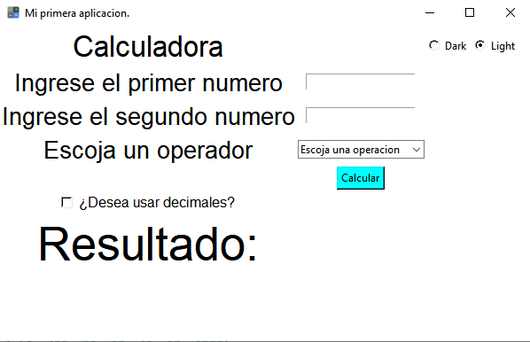
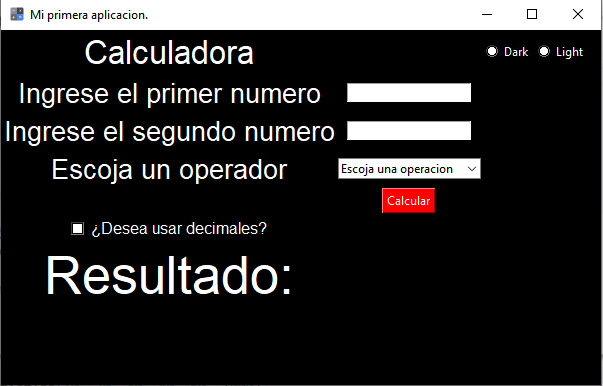

# Mini---Calculadora
Proyecto en clase de mini calculadora.
Hecho por: Camilo Andres Cuello Romero

Widgets extra:
-Checkbutton : Verifica si se quiere o no decimales.
-Radiobuttons : Modifican el color de énfaseis en la ventana (dark y light mode).
-Ventanas emergentes: Ventanas que muestran advertencias y errores, como por ejemplo la división por cero.
-Ícono en la ventana.

Logo: 

Interface Light Mode:

Interface Dark Mode:

